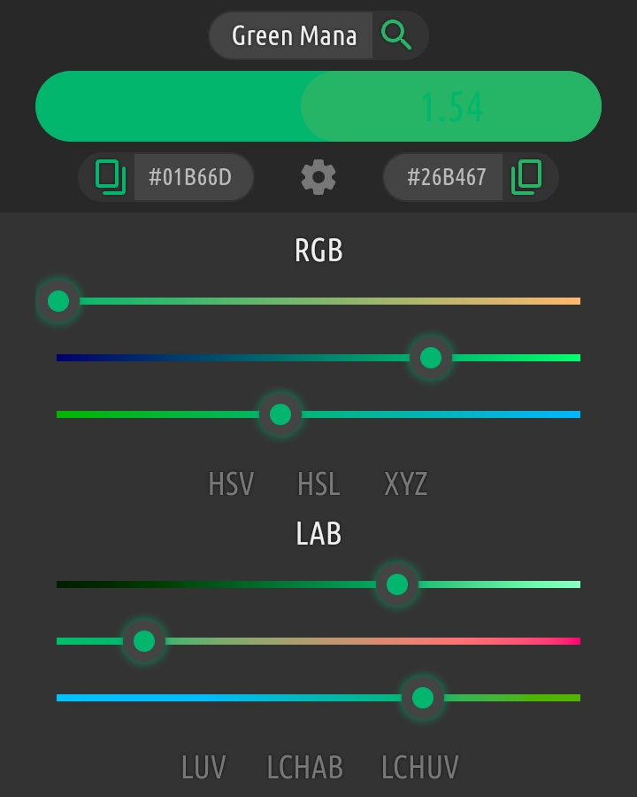
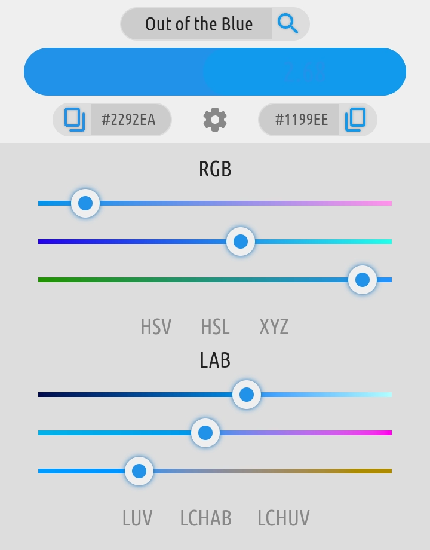
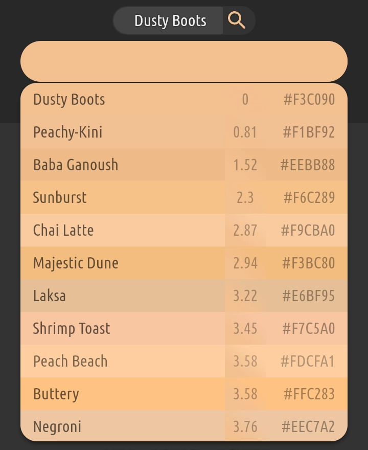
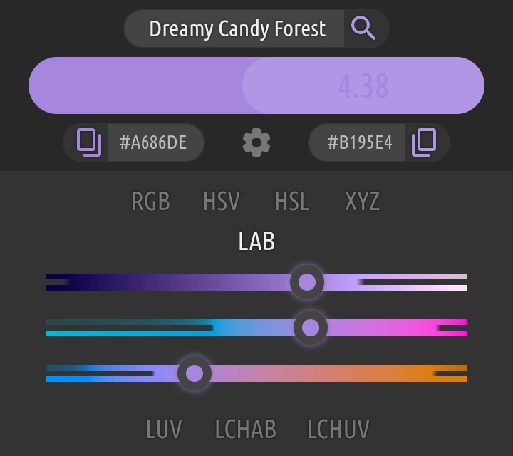
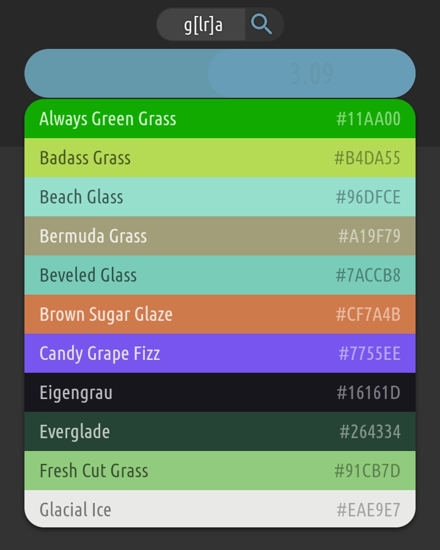
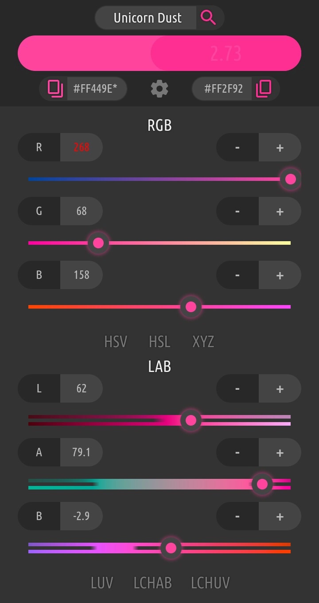
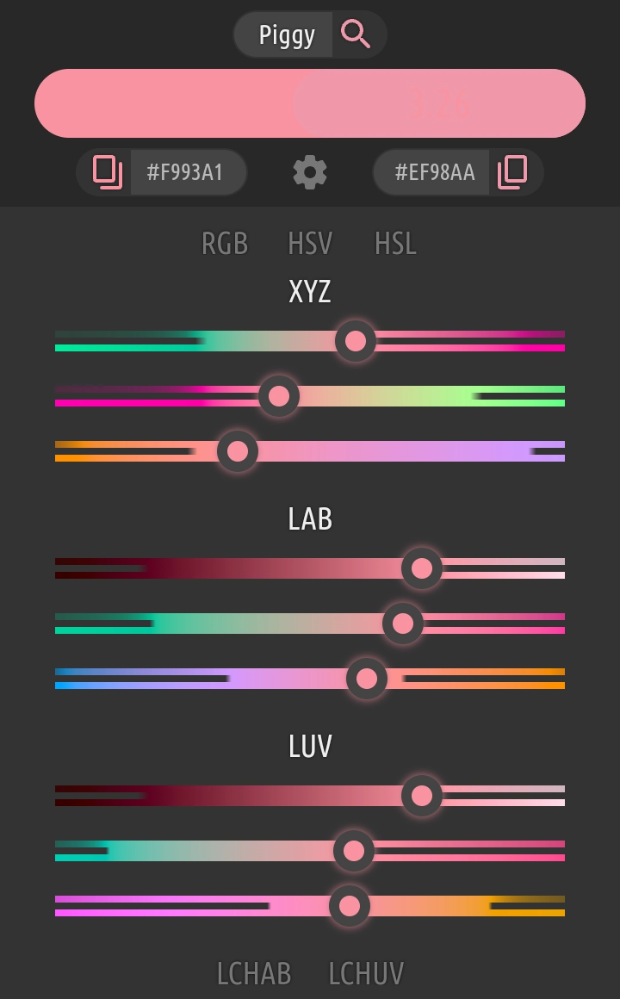
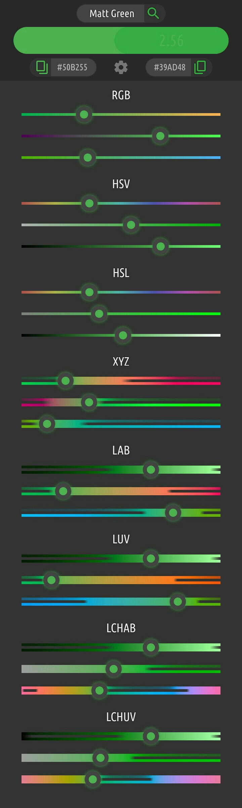

# [Chromania](https://impawstarlight.github.io/chromania)
A collection of color tools\
[Click here](https://impawstarlight.github.io/chromania)
for live demo

## What's new: v1.1 - 4 April 2022
- Nearby/Similar colors - Click the match color box
- Slider optimization - Less lag hopefully
- User interace explained - [See below](#user-interface)

## Overview
- **Name**\
Find the name of a desired color from a handpicked
list of ~4k [color names](https://github.com/meodai/color-names)

- **Convert**\
Convert between various color spaces as your need
with dyanamic *shiny* sliders

- **Palette & Gradient** Upcoming\
Create beautiful & well balanced color palettes
& gradients using perceptually uniform color
spaces to achieve best visual consistency

- **Auto/Random theme engine** Upcoming\
Let's see how it goes

# User Interface

Everything is pretty much intuitive, except a few
things...

- Click the input color block to get a random color

- Click the match color block to see nearby/similar colors

- The number you may see inside the match color block is
the [color difference](DeltaE200) between the input & match.
You may not see it clearly when the difference is small.

- You can use Regular Expression in the search box

- An asterisk will appear in the input hex when
gamut clipping happens (RGB values are out of gamut/range)

- Geek mode: The missing parts of the slider
background strip are out of gamut colors that can't
be shown in RGB colorspace.
-The bottom strip shows
estimated colors in those places by clamping RGB
values within range.
-The top strip shows the estimated
colors with adjusted transparency indicating the extent of
gamut clipping, that is, the more out of range, the
more faint colors.

## Credits

***Inspired from***\
[Name that Color](https://chir.ag/projects/name-that-color)

***List of color names***\
[GitHub/meodai/color-names](https://github.com/meodai/color-names)

